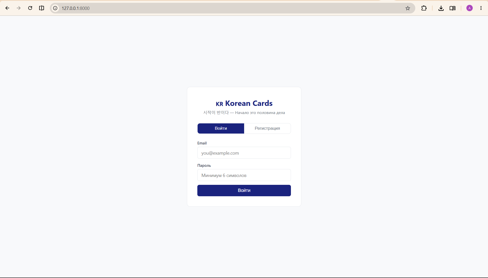
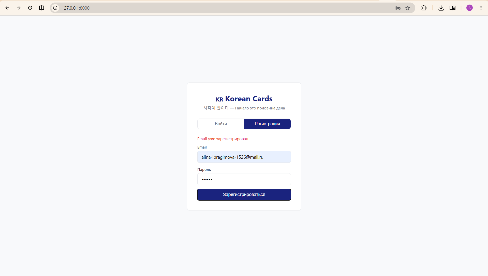
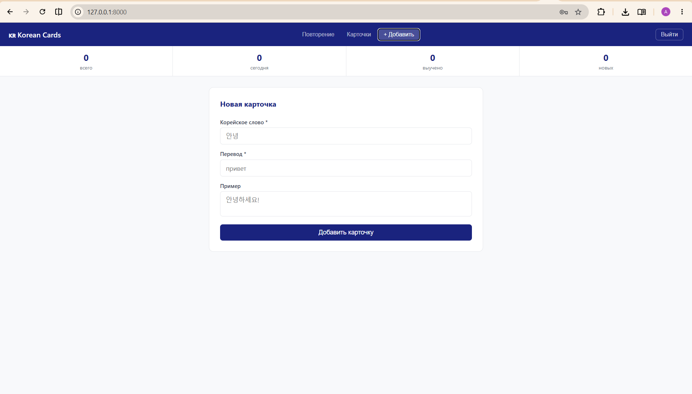
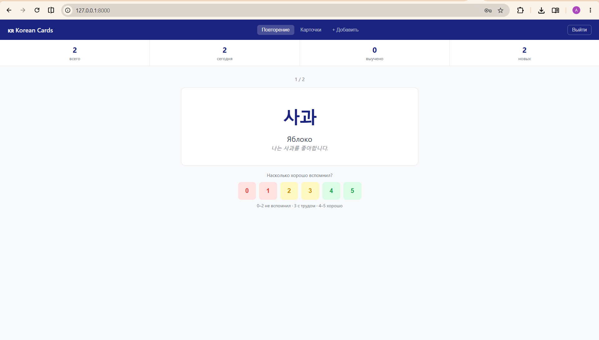
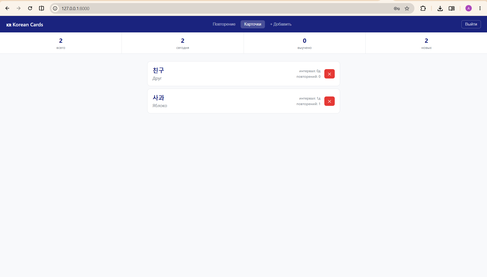
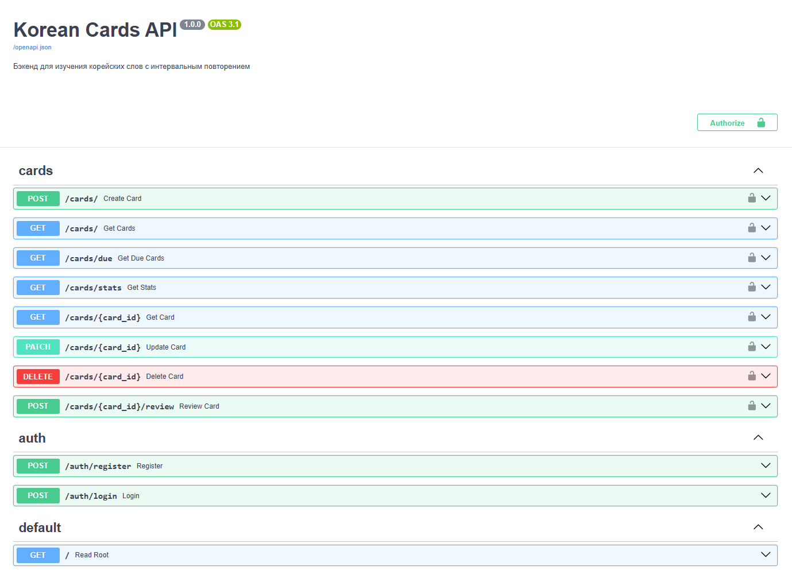

# Korean Cards API

Бэкенд для изучения корейских слов с использованием алгоритма интервального повторения (SM-2).

## Возможности

- Регистрация и авторизация пользователей (JWT)
- CRUD для карточек (корейское слово + перевод + пример)
- Алгоритм SM-2: карточки показываются именно тогда, когда их пора повторить
- Статистика прогресса
- Простой веб-интерфейс

## Технологии

- **FastAPI** — фреймворк
- **PostgreSQL** — база данных
- **SQLAlchemy** — ORM
- **Alembic** — миграции
- **Pydantic** — валидация данных
- **JWT** — авторизация
- **Docker + docker-compose** — запуск

  
   <em>Экран входа / регистрации</em>

  
   <em>Экран входа / регистрации с ошибкой</em>

  
   <em>Добавление новой карточки</em>

  
   <em>Повторение новой карточки</em>

  
   <em>Список карточек</em>

  
   <em>Документация</em>

